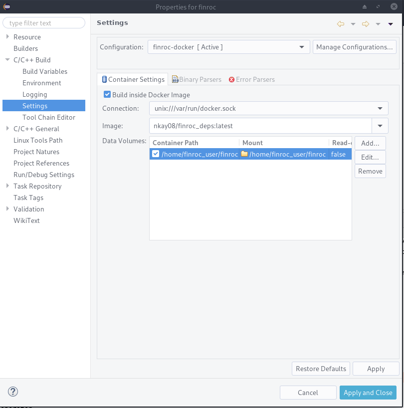
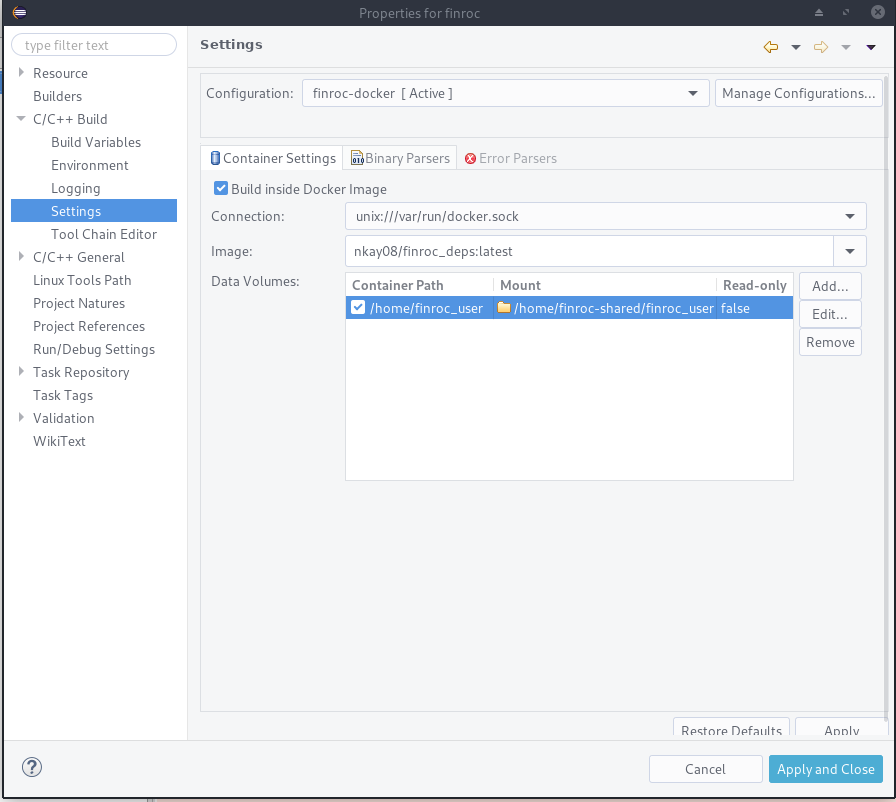

# docker-finroc_deps
An ubuntu image with basic dependencies to build and run a finroc environment.

## Prerequisites
- `docker`
- optional `docker-compose`

# Running
## Via Docker
`docker run -v finroc_user:/home/finroc_user -i -t nkay08/finroc_deps bash`
## Via Docker compose
`docker-compose run finroc bash`

### Note: Adjust volumes if necessary!
By default (for `docker-compose`) the folder `./finroc_user` (relative to the current console) is mounted as `/home/finroc_user` within the container
### Tip:
When setting up a folder for use as volume, `chmod -R 777 <folder>` allows any user to write to this folder. This allows you to edit files from within the container and from your host computer.

# Running a docker container WITHOUT any volumes will not save any data at all between runs. All user data is lost !

# Extending image with further packages
Write a new Dockerfile
```
FROM nkay08/finroc_deps

USER root

RUN apt-get update && \
    DEBIAN_FRONTEND=noninteractive apt-get install -y --no-install-recommends  -o=Dpkg::Use-Pty=0 \
    <YOUR_NEW_PACKAGES> \
    && rm -rf /var/lib/apt/lists/*  
    
USER finroc_user
```

# Running Finroc
We will not provide a finroc instatllation here, only the system and dependencies to build and run it.
Some finroc libraries or projects may need additional dependencies. You should be notified about them when building.

You can download your finroc installation from within the container or download it externally to the folder mounted at `/home/finroc_user`. You can treat the environment within the container as a normal linux home. Thus you can create authorization files for mercurial (`.hgrc)` or git if necessary within `/home/finroc_user`.

# X11 Session for graphical interfaces or other simulation
[https://github.com/nkay08/docker-finroc_deps-x11](https://github.com/nkay08/docker-finroc_deps-x11)

# Using Eclipse to build inside the docker container
- `docker pull nkay08/finroc_deps:latest` to get the latest image
- Go to `Project -> Properties`, then `C/C++ Build -> Settings` and in the `Container Settigns` tab check `Build inside Docker image`
    - Select the docker image `nkay08/finroc_deps:latest`
    - Add your folder that is mounted at `/home/finroc_user` or `/home/finroc_user/finroc`
    
    
- Now you should be able to build within eclipse using this Docker image
